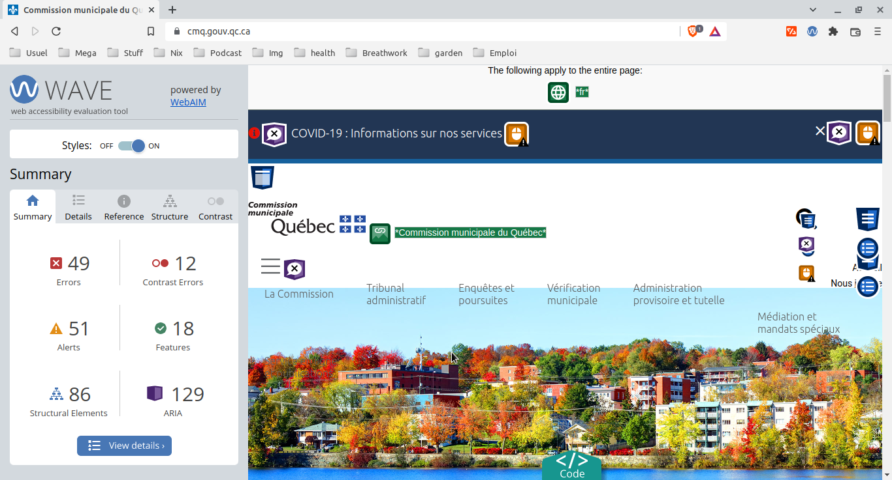
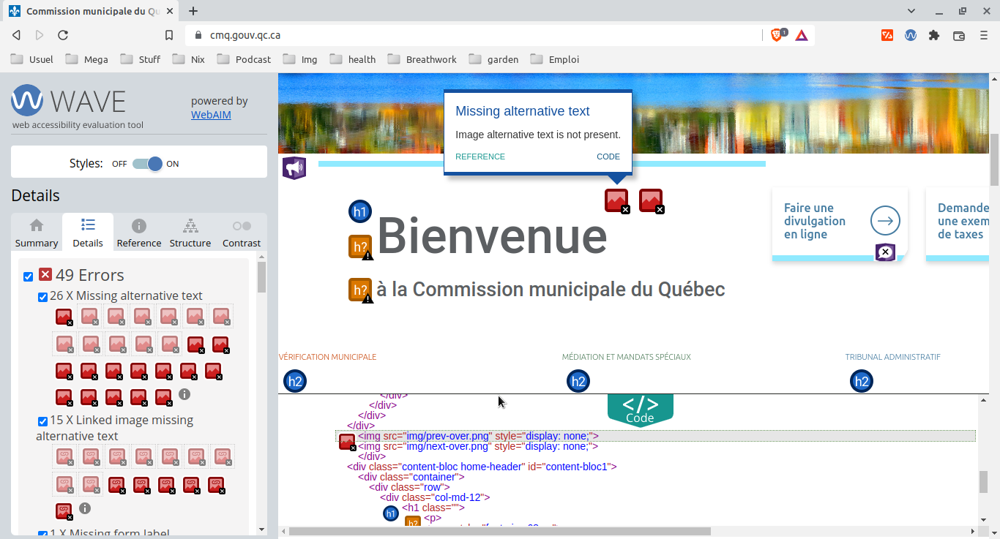

# WAVE

[Web Accessibility In Mind](https://webaim.org/) a développé un outil en ligne gratuit, [WAVE](https://wave.webaim.org/), pour évaluer le respect des critères du WCAG.

Il est également disponible sous la forme [d'une extension pour la plupart des navigateurs](https://wave.webaim.org/extension/).

Une [API](https://wave.webaim.org/api/) est également disponible afin d'intégrer l'outil dans une application.

Le tout fut développé par l'Université de l'Utah et repose sur une [license fermée](https://wave.webaim.org/terms).

Exemple d'exécution :

Il n'est pas possible d'exporter le rapport produit.