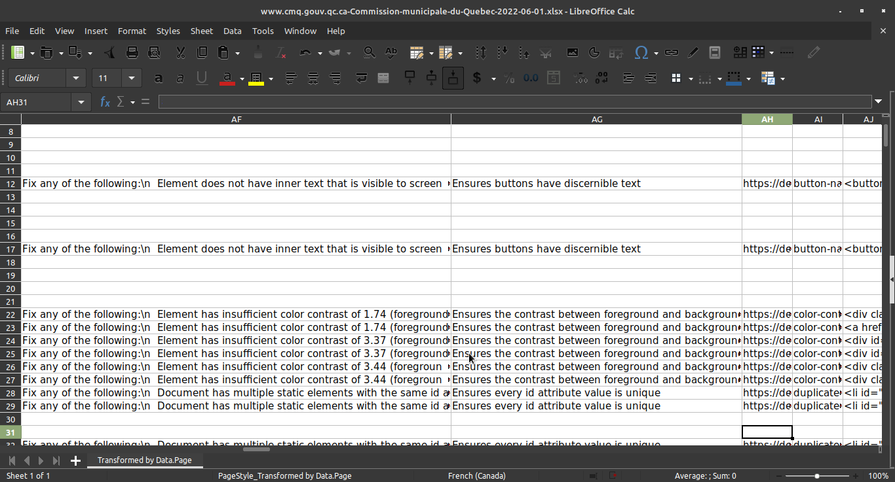
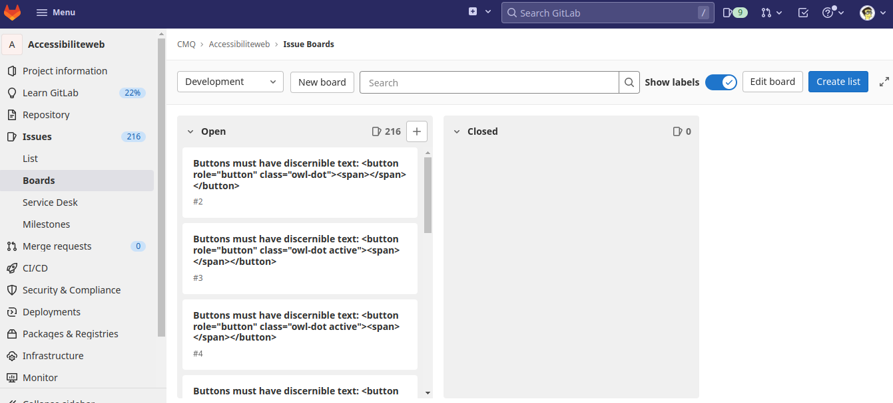

# Propositions

## Fichier Excel

[Exemple](www.cmq.gouv.qc.ca-Commission-municipale-du-Quebec-2022-06-01.xlsx)

### Avantages

- Solution simple
- Outil connu

### Inconvénients

- Inefficace
- Sujet aux erreurs (gestion manuelles)

## Outil de gestion de projet

[Exemple GitLab](https://gitlab.com/cmq1/Accessibiliteweb/-/boards)

### Avantages

- Efficace
- Réutilisable (gestion du développement du site web)

### Inconvénients

- Nécessite un apprentissage
- Peut nécessiter l'achat d'une license
