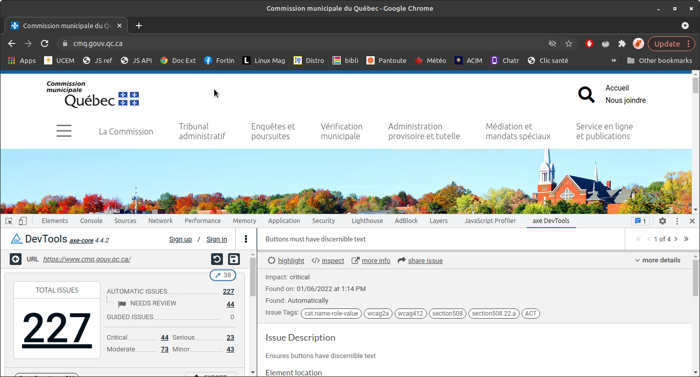
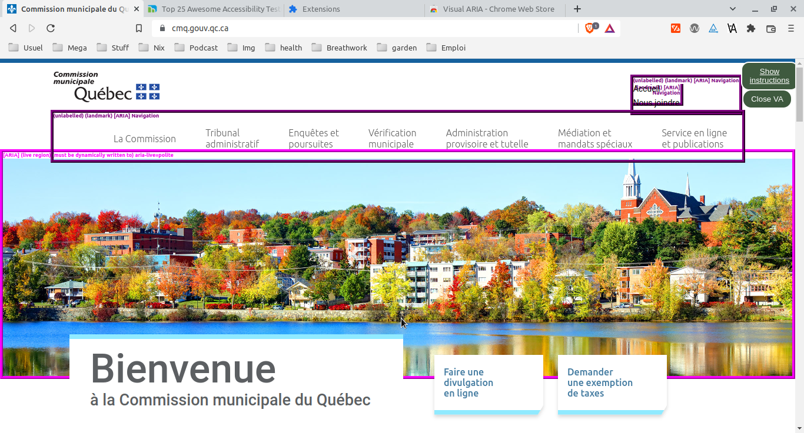
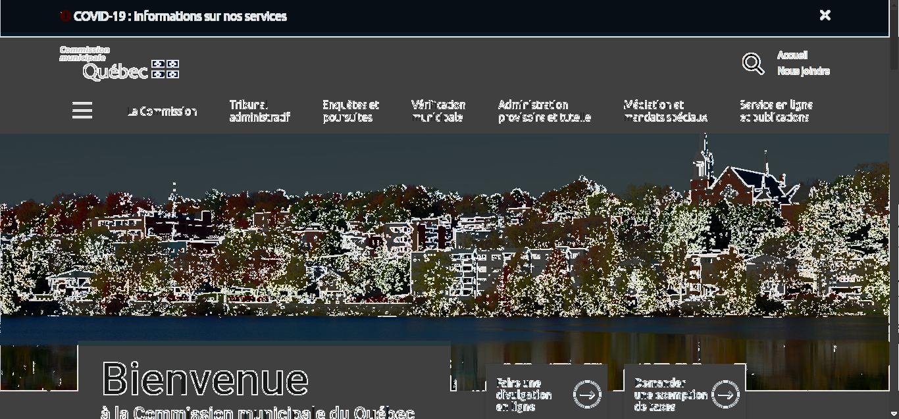

# Solutions

Il existe plusieurs produits commerciaux pour évaluer l'accessibilité d'un site.

Je n'en ai testé qu'un seul, [AXE](https://auth.deque.com/). Une version démo était disponible.

Il s'agit d'une extension qui s'ajoute au .

La fonctionnalité qui m'a intéressé le plus est de pouvoir exporter le rapport (format CSV ou JSON).

Il existe aussi des extensions pour tester des aspects plus précis de la norme, comme .

Ou une extension pour tester .

Je n'ai pas approfondi la recherche davantage.